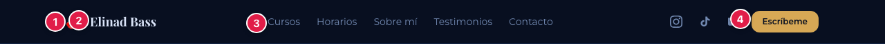
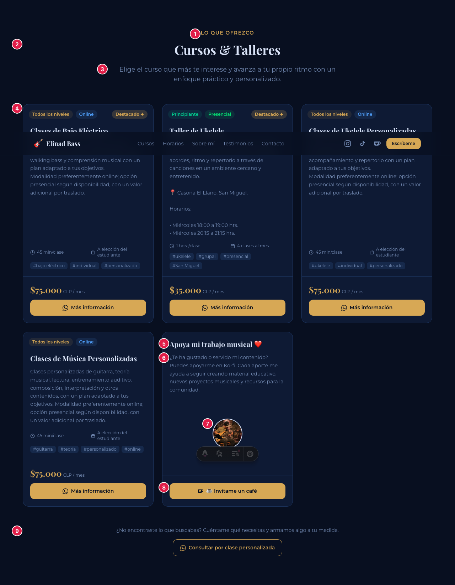
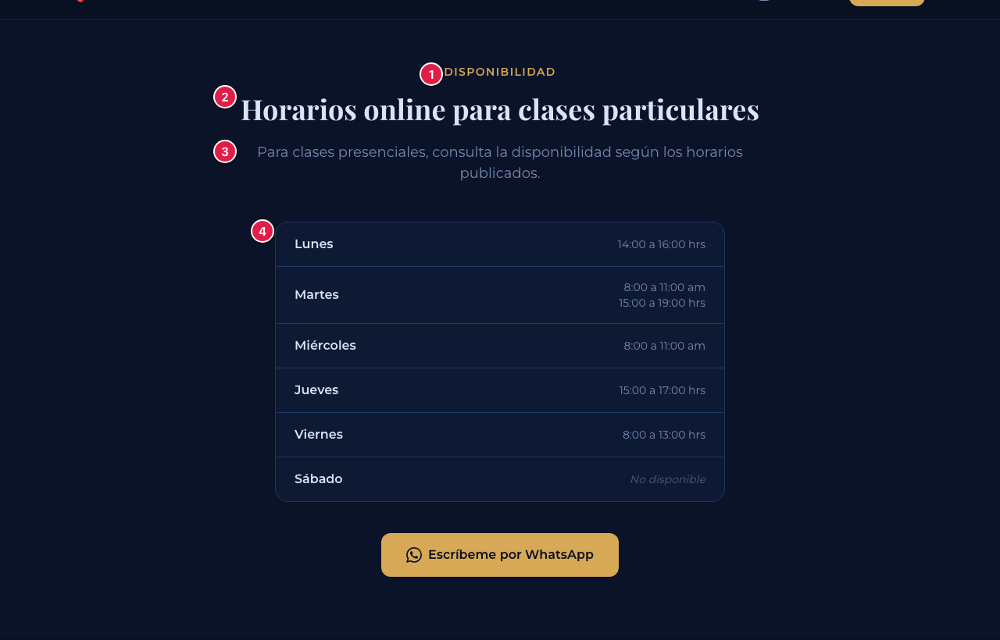
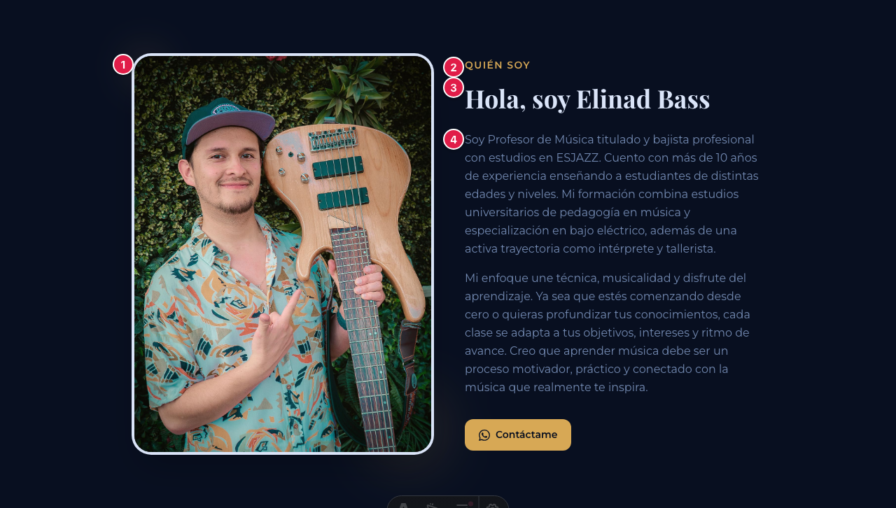
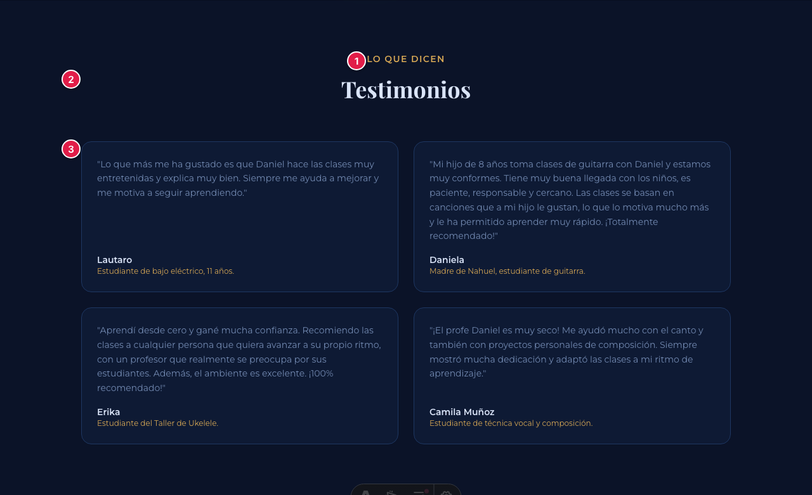
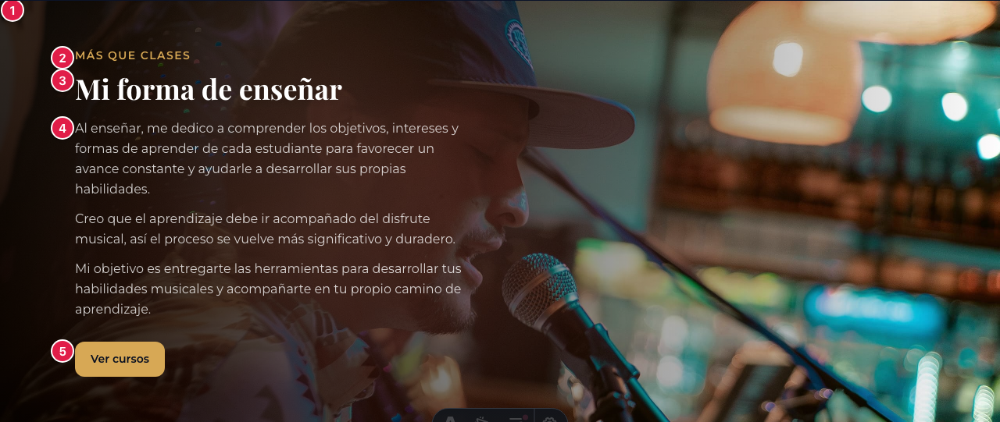
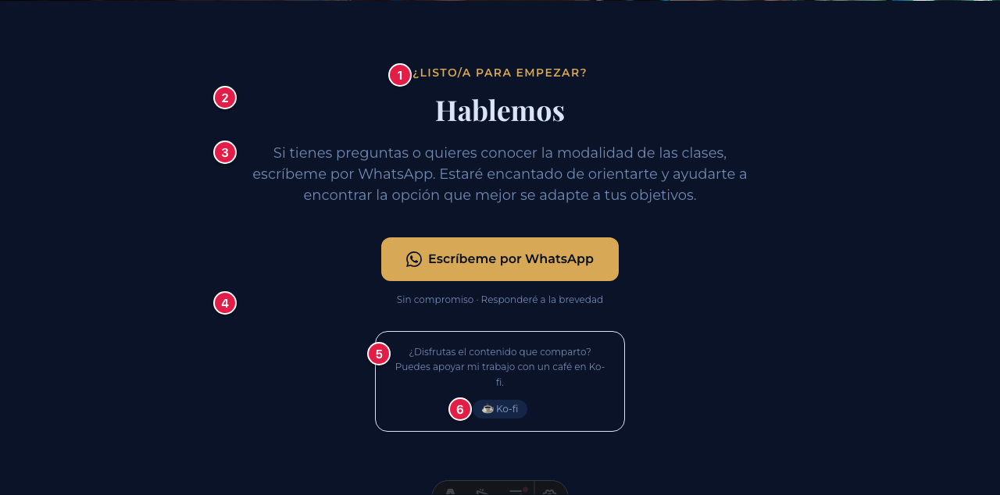
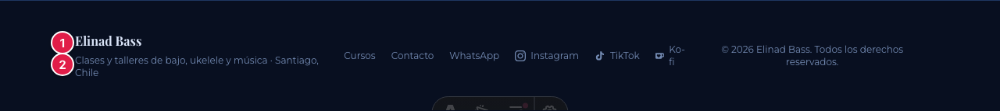

# Guía para editar la página de Elinad Bass

Esta guía es para **actualizar el contenido del sitio sin saber programar**: textos, precios, horarios, testimonios, fotos y enlaces.

No hace falta entender nada de código. Tampoco puedes romper la página: si algo queda mal escrito, el sitio publicado **se queda como estaba** hasta que se corrija.

---

## Índice

1. [Cómo funciona esto (léelo una vez)](#1-cómo-funciona-esto)
2. [Editar con el editor visual](#2-editar-con-el-editor-visual-la-forma-recomendada)
3. [Recetas: las tareas más comunes](#3-recetas-las-tareas-más-comunes)
4. [📖 Diccionario: qué controla cada cosa](#4--diccionario-qué-controla-cada-cosa)
5. [Editar directamente en GitHub](#5-editar-directamente-en-github-plan-b)
6. [Si algo sale mal](#6-si-algo-sale-mal)

---

## 1. Cómo funciona esto

Todo el contenido de la página vive en **dos archivos**:

| Archivo | Qué contiene |
|---|---|
| `src/data/page_data.json` | Todos los textos, fotos, enlaces y horarios |
| `src/data/courses.json` | Los cursos y talleres (nombre, precio, nivel…) |

Cuando guardas un cambio, pasa esto solo:

```
Guardas  →  se revisa que esté bien escrito  →  se publica  →  se ve online
                        │
                        └─ si algo está mal, SE DETIENE aquí
                           y la página sigue mostrando la última versión buena
```

**El cambio tarda 1 o 2 minutos en verse.** Si acabas de guardar y no ves nada, espera un momento y recarga la página con `Ctrl+Shift+R` (Windows) o `Cmd+Shift+R` (Mac).

> ⚠️ **Solo texto normal.** No escribas etiquetas tipo `<b>` ni `<br>`: aparecerían tal cual en la página. Para poner negrita o cambiar colores, hay que tocar el diseño.

---

## 2. Editar con el editor visual (la forma recomendada)

El editor visual te muestra **formularios** con el nombre de cada campo en español. No ves llaves, comillas ni comas.

### Entrar

1. Abre **[app.pagescms.org](https://app.pagescms.org)**
2. Inicia sesión con el acceso que te compartieron
3. Elige el repositorio del sitio

Verás dos secciones en el menú lateral:

- **Contenido de la página** → todos los textos y fotos
- **Cursos y talleres** → los cursos, precios y niveles

### Guardar

Haz tus cambios y pulsa **Save**. Eso es todo: la publicación es automática.

---

## 3. Recetas: las tareas más comunes

### Cambiar el precio de un curso

1. Entra a **Cursos y talleres**
2. Haz clic en el curso
3. Cambia el campo **Precio**
4. **Save**

> 💡 Escribe **solo el número, sin puntos ni signo peso**. Para $35.000 escribe `35000`. Si pones `35.000` el sistema lo rechazará y te avisará.

### Cambiar un horario

1. **Contenido de la página** → **3 · Sección "Horarios"**
2. Busca **Horario de cada día** y ubica el día
3. Edita las horas. Un horario por línea: un día puede tener varios (por ejemplo, mañana y tarde)
4. Si un día deja de tener clases, desmarca **¿Hay clases ese día?** y escribe `No disponible` en las horas

### Agregar un testimonio

1. **Contenido de la página** → **5 · Sección "Testimonios"**
2. En **Testimonios**, pulsa el botón de **añadir**
3. Rellena **Nombre**, **Quién es** y **Testimonio**
4. **Save**

> 💡 No escribas las comillas del testimonio: se agregan solas al mostrarlo.

### Cambiar una foto

1. Ve al campo de la foto que quieras cambiar (ver el [diccionario](#4--diccionario-qué-controla-cada-cosa))
2. Pulsa sobre la imagen y sube la nueva
3. **Save**

> ⚠️ **Muy importante:** ponle a cada foto nueva un **nombre distinto** al de la anterior (por ejemplo `retrato-2026.jpg` en vez de `retrato3.jpg`). Si repites el nombre, mucha gente seguirá viendo la foto vieja porque su navegador la tiene guardada.
>
> Además, el nombre del archivo **no debe llevar espacios**. Usa guiones: `foto-elinad.jpg`, no `foto elinad.jpg`.

#### Sobre el peso de las fotos

Las fotos que salen de una cámara o un celular pesan mucho (5 a 10 MB). Ese peso lo descarga **cada persona que entra al sitio**, así que una foto pesada hace que la página tarde en aparecer — sobre todo con datos móviles.

No hace falta que hagas nada especial: **sube la foto tal como la tienes**. Pero avísale a quien mantiene el sitio para que la optimice. Es un comando y no se nota ninguna diferencia visual:

```bash
npm run optimizar-imagenes            # muestra qué se puede mejorar
npm run optimizar-imagenes -- --aplicar
```

> 💡 Si puedes elegir, una foto de alrededor de **2500 píxeles de ancho** es más que suficiente para cualquier pantalla. Más grande que eso es peso que nadie llega a ver.

### Agregar un curso nuevo

1. **Cursos y talleres** → botón de **añadir**
2. Rellena los campos. Los tres que más importan:
   - **Identificador interno**: un nombre corto, sin espacios ni tildes, distinto al de los demás cursos. Ejemplo: `taller-guitarra`
   - **Nivel** y **Modalidad**: elige de la lista. No escribas valores nuevos, o la etiqueta de color no se verá bien
   - **Precio**: solo el número
3. **Save**

> 💡 Si agregas o quitas cursos, acuérdate de actualizar el número de la portada (**1 · Portada** → **Los tres números**). Ese número no se actualiza solo.

### Cambiar el número de WhatsApp

**Contenido de la página** → **WhatsApp** → **Número de WhatsApp**.

Con código de país y sin espacios: `+56965017566`. Ese único campo alimenta **todos** los botones de la página.

---

## 4. 📖 Diccionario: qué controla cada cosa

Cada número rojo de las imágenes corresponde a una fila de la tabla de abajo.

La columna **"En el editor visual"** te dice dónde encontrarlo en [app.pagescms.org](https://app.pagescms.org). La columna **"Nombre técnico"** solo la necesitas si editas el archivo a mano en GitHub.

---

### Encabezado y menú



| Nº | En el editor visual | Nombre técnico | Qué es |
|---|---|---|---|
| 1 | Datos generales → Emoji del logo | `negocio.emoji_logo` | El dibujito junto al nombre |
| 2 | Datos generales → Nombre del sitio | `negocio.nombre` | El nombre arriba a la izquierda |
| 3 | Menú de navegación | `menu` | Los enlaces de arriba. Puedes cambiar el texto, no a qué sección llevan |
| 4 | WhatsApp → Texto del botón del menú | `contacto.boton_menu` | El botón dorado de la esquina |

> Los iconos de Instagram, TikTok y Ko-fi se editan en **Redes sociales**. Ahí cambias el enlace de cada uno.

---

### 1 · Portada


| Nº | En el editor visual | Nombre técnico | Qué es |
|---|---|---|---|
| 1 | Portada → Foto de fondo | `portada.imagen_fondo` | La foto grande detrás del título |
| 2 | Portada → Texto del recuadro pequeño | `portada.pre_titulo` | La línea con borde redondeado |
| 3 | Portada → Título grande | `portada.titulo` | El texto más grande de la página |
| 4 | Portada → Párrafo bajo el título | `portada.descripcion` | El párrafo explicativo |
| 5 | Portada → Texto del botón dorado | `portada.boton_ver_cursos` | El botón que baja a los cursos |
| 6 | Portada → Los tres números | `portada.estadisticas` | Los tres recuadros con cifras |

> El botón "Escribir por WhatsApp" y su mensaje están en los campos **Texto del botón de WhatsApp** y **Mensaje que se envía por WhatsApp**, en esa misma sección.

---

### 2 · Cursos y talleres



| Nº | En el editor visual | Nombre técnico | Qué es |
|---|---|---|---|
| 1 | Sección "Cursos & Talleres" → Texto pequeño sobre el título | `cursos_seccion.pre_titulo` | "Lo que ofrezco" |
| 2 | Sección "Cursos & Talleres" → Título de la sección | `cursos_seccion.titulo` | El título grande |
| 3 | Sección "Cursos & Talleres" → Párrafo bajo el título | `cursos_seccion.bajada` | La frase explicativa |
| 4 | **Cursos y talleres** (menú aparte) | `cursos` | **Todas las tarjetas de cursos** |
| 5 | Tarjeta de Ko-fi → Título de la tarjeta | `cursos_seccion.tarjeta_kofi.titulo` | Título de la tarjeta de aportes |
| 6 | Tarjeta de Ko-fi → Texto de la tarjeta | `cursos_seccion.tarjeta_kofi.texto` | Su descripción |
| 7 | Tarjeta de Ko-fi → Foto | `cursos_seccion.tarjeta_kofi.imagen` | La foto redonda |
| 8 | Tarjeta de Ko-fi → Texto del botón | `cursos_seccion.tarjeta_kofi.boton` | "☕ Invítame un café" |
| 9 | Sección "Cursos & Talleres" → Frase bajo los cursos | `cursos_seccion.texto_final` | La frase del final |

**Los campos de cada curso** (número 4) están en la sección **Cursos y talleres** del menú lateral:

| En el editor visual | Nombre técnico | Notas |
|---|---|---|
| Nombre del curso | `titulo` | |
| Descripción | `descripcion` | Puedes usar Enter. Se respetan saltos, viñetas (•) y emojis |
| Nivel | `nivel` | Elige de la lista. Define el color de la etiqueta |
| Modalidad | `modalidad` | Elige de la lista |
| Duración de cada clase | `duracion` | Ej: `45 min/clase` |
| Cuántas clases | `frecuencia` | Ej: `4 clases al mes` |
| Precio | `precio` | **Solo el número**, sin puntos |
| Texto junto al precio | `sufijo_precio` | La letra chica al lado. Ej: `CLP / mes` |
| ¿Mostrar "Destacado"? | `destacado` | Muestra la etiqueta dorada |
| Etiquetas | `etiquetas` | Las palabras con `#`. Escríbelas sin el `#` |
| Mensaje de WhatsApp | `mensaje_whatsapp` | Lo que se escribe solo al tocar "Más información" |
| Identificador interno | `id` | **No lo cambies** en cursos que ya existen |

---

### 3 · Horarios



| Nº | En el editor visual | Nombre técnico | Qué es |
|---|---|---|---|
| 1 | Sección "Horarios" → Texto pequeño sobre el título | `horarios.pre_titulo` | "Disponibilidad" |
| 2 | Sección "Horarios" → Título de la sección | `horarios.titulo` | El título grande |
| 3 | Sección "Horarios" → Párrafo bajo el título | `horarios.bajada` | La aclaración sobre clases presenciales |
| 4 | Sección "Horarios" → Horario de cada día | `horarios.dias` | **Toda la tabla de días y horas** |

---

### 4 · Sobre mí



| Nº | En el editor visual | Nombre técnico | Qué es |
|---|---|---|---|
| 1 | Sección "Sobre mí" → Foto de perfil | `sobre_mi.imagen` | La foto vertical |
| 2 | Sección "Sobre mí" → Texto pequeño sobre el título | `sobre_mi.pre_titulo` | "Quién soy" |
| 3 | Sección "Sobre mí" → Título de la sección | `sobre_mi.titulo` | "Hola, soy Elinad Bass" |
| 4 | Sección "Sobre mí" → Párrafos | `sobre_mi.parrafos` | Los párrafos de presentación. **Cada elemento de la lista es un párrafo aparte** |

---

### 5 · Testimonios



| Nº | En el editor visual | Nombre técnico | Qué es |
|---|---|---|---|
| 1 | Sección "Testimonios" → Texto pequeño sobre el título | `testimonios.pre_titulo` | "Lo que dicen" |
| 2 | Sección "Testimonios" → Título de la sección | `testimonios.titulo` | "Testimonios" |
| 3 | Sección "Testimonios" → Testimonios | `testimonios.listado` | **Todas las tarjetas.** Cada una tiene nombre, quién es y el comentario |

---

### 6 · Mi forma de enseñar



| Nº | En el editor visual | Nombre técnico | Qué es |
|---|---|---|---|
| 1 | Sección "Mi forma de enseñar" → Foto de fondo | `forma_de_ensenar.imagen` | La foto ancha del fondo |
| 2 | Sección "Mi forma de enseñar" → Texto pequeño sobre el título | `forma_de_ensenar.pre_titulo` | "Más que clases" |
| 3 | Sección "Mi forma de enseñar" → Título de la sección | `forma_de_ensenar.titulo` | El título |
| 4 | Sección "Mi forma de enseñar" → Párrafos | `forma_de_ensenar.parrafos` | Los párrafos sobre el método |
| 5 | Sección "Mi forma de enseñar" → Texto del botón | `forma_de_ensenar.boton` | "Ver cursos" |

> 💡 Para esta foto conviene una **horizontal** con espacio libre a la izquierda, porque el texto va encima de esa zona.

---

### 7 · Hablemos (final)



| Nº | En el editor visual | Nombre técnico | Qué es |
|---|---|---|---|
| 1 | Sección "Hablemos" → Texto pequeño sobre el título | `contacto_final.pre_titulo` | "¿Listo/a para empezar?" |
| 2 | Sección "Hablemos" → Título de la sección | `contacto_final.titulo` | "Hablemos" |
| 3 | Sección "Hablemos" → Párrafo bajo el título | `contacto_final.descripcion` | La invitación a escribir |
| 4 | Sección "Hablemos" → Frase pequeña bajo el botón | `contacto_final.nota` | "Sin compromiso · Responderé a la brevedad" |
| 5 | Recuadro de Ko-fi → Texto del recuadro | `contacto_final.caja_kofi.texto` | El texto del recuadro. **Puedes usar Enter** para partirlo en dos líneas |
| 6 | Recuadro de Ko-fi → Texto del botón | `contacto_final.caja_kofi.boton` | "☕ Ko-fi" |

---

### Pie de página



| Nº | En el editor visual | Nombre técnico | Qué es |
|---|---|---|---|
| 1 | Datos generales → Nombre del sitio | `negocio.nombre` | El mismo nombre del encabezado |
| 2 | Datos generales → Frase del pie de página | `negocio.descripcion_pie_de_pagina` | La línea pequeña del final |

> El año del copyright se actualiza solo. No hay que tocarlo.

---

### Textos que no se ven en la página

Están en **Google y redes sociales**, y son importantes aunque no aparezcan en pantalla:

| En el editor visual | Nombre técnico | Dónde se ve |
|---|---|---|
| Título en la pestaña del navegador | `seo.titulo_pestana` | En la pestaña y como título azul en Google |
| Descripción para Google | `seo.descripcion_buscadores` | El párrafo gris bajo el título en Google |
| Descripción corta del negocio | `seo.descripcion_negocio` | En fichas de negocio de Google |
| Profesión | `seo.profesion` | Google lo usa para saber a qué te dedicas |
| Imagen al compartir el link | `seo.imagen_al_compartir` | **La foto que aparece al pegar el link en WhatsApp o Instagram** |

---

## 5. Editar directamente en GitHub (Plan B)

Usa esto solo si el editor visual no está disponible. Aquí sí ves el archivo por dentro, así que hay que tener más cuidado.

### Pasos

1. Entra al repositorio en github.com
2. Abre la carpeta `src` → `data`
3. Haz clic en `page_data.json` (o `courses.json` para los cursos)
4. Pulsa el **lápiz** ✏️ de arriba a la derecha
5. Busca el texto que quieres cambiar y edítalo
6. Baja hasta el final y pulsa **Commit changes**

### Las 4 reglas de oro

El archivo tiene un formato estricto. Si se rompe, no se publica (pero la página online **sigue funcionando**).

**1. Cambia solo lo que está a la derecha de los dos puntos, dentro de las comillas.**

```json
"titulo": "Aprende bajo eléctrico, ukelele y música a tu ritmo"
           └────────────── esto sí ──────────────┘
 └─ esto NO
```

**2. Las comillas van siempre en pareja.** Si borras una, se rompe.

**3. Cada línea termina en coma… menos la última de su bloque.**

```json
"pre_titulo": "Quién soy",        ← lleva coma
"titulo": "Hola, soy Elinad Bass" ← la última NO lleva coma
```

**4. Si tu texto necesita comillas, usa las simples `'`.** Las dobles `"` rompen el archivo.

```json
"titulo": "El taller 'Ukelele desde cero'"    ✅
"titulo": "El taller "Ukelele desde cero""    ❌
```

### Para saltos de línea

En los campos que lo permiten, un salto de línea se escribe `\n`:

```json
"texto": "¿Disfrutas el contenido que comparto?\nPuedes apoyar mi trabajo con un café."
```

---

## 6. Si algo sale mal

### "Guardé y no veo el cambio"

1. Espera 2 minutos: la publicación no es instantánea
2. Recarga forzando: `Ctrl+Shift+R` (Windows) o `Cmd+Shift+R` (Mac)
3. Si sigue igual, mira el punto siguiente

### "Aparece una marca roja ❌ en GitHub"

Significa que algo del contenido quedó mal escrito y **la publicación se detuvo a propósito**.

**La página online no se rompió.** Sigue mostrando la última versión correcta.

Para ver qué pasó:

1. En el repositorio, entra a la pestaña **Actions**
2. Abre la ejecución que tiene la ❌ roja
3. Busca el recuadro con el mensaje. Está en español y dice exactamente qué corregir. Por ejemplo:

```
══════════════════════════════════════════════════════════
  ❌ Hay 1 problema(s) en el contenido del sitio
══════════════════════════════════════════════════════════

  1. cursos[2].precio → debe ser un número sin puntos, comas ni
     símbolos. Ejemplo correcto: 35000. Valor recibido: "35.000"

  ℹ️  La página publicada NO cambió: sigue online la última
      versión correcta. Corrige estos puntos y guarda de nuevo.
```

4. Corrige eso y vuelve a guardar

### "Quiero deshacer mi último cambio"

1. En el repositorio, entra a **Commits** (el listado de cambios)
2. Abre el cambio que quieres deshacer
3. Pulsa **Revert** y confirma

Eso crea un cambio nuevo que deja todo como estaba antes.

### Errores más frecuentes

| Mensaje | Qué significa | Solución |
|---|---|---|
| `debe ser un número sin puntos` | Escribiste el precio con puntos o con `$` | Escribe `35000`, no `$35.000` |
| `solo acepta uno de estos valores exactos` | Un Nivel o Modalidad mal escrito | Cópialo exacto de la lista, respetando mayúsculas y tildes |
| `la imagen no existe en el repositorio` | Se borró o renombró una foto | Vuelve a subirla o elige otra |
| `tiene espacios` | El archivo se llama `foto elinad.jpg` | Renómbralo a `foto-elinad.jpg` |
| `está vacío` | Un campo obligatorio quedó en blanco | Escribe algo |
| `falta una coma` | Solo al editar a mano en GitHub | Revisa la línea que indica el mensaje |

---

## ¿Y si necesito cambiar algo que no está aquí?

Los **colores, tipografías, el orden de las secciones y el diseño** no se editan desde aquí: son parte del código. Para eso, habla con quien mantiene el sitio.
